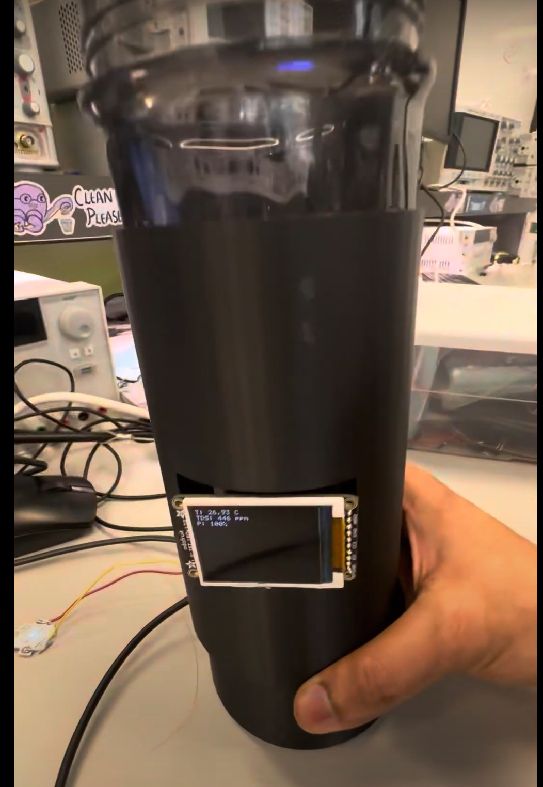

# a14g-final-submission

    * Team Number: 28
    * Team Name: AQUA
    * Team Members: Xiaopeng Jin & Venkatesh
    * Github Repository URL: https://github.com/ese5160/a14g-final-submission-s25-t28-aqua.git
    * Description of test hardware: Two smart brain

## 1. Video Presentation

Our video is shown below:

## 2. Project Summary

### Device Description

Our device is a smart water bottle equipped with sensors including temperature, pressure, TDS, and a motion sensor. It monitors hydration behavior and water quality in real time, issuing alerts when no drinking activity is detected and activating UVC purification when water quality drops.

#### Project Inspiration and Problems Solved

Our project was inspired by the need to promote healthier hydration habits and ensure safe drinking water. We all know how easy it is to forget to hydrate during busy routines — especially when working or studying for long hours. We noticed that while many people carry reusable bottles, they often forget to drink from them or don’t know if the water is fresh or clean. With affordable sensors and IoT platforms becoming more accessible, we thought we could build a smart bottle that monitors water quality and consumption and syncs that info to a web dashboard in real-time. This combines health awareness with modern connected tech to make a simple tool to encourage better hydration habits.

We aim to solve the problem of unintentional dehydration and exposure to contaminated water, especially in daily or travel scenarios. Our device addresses three key problems: forgetting to drink water, consuming low-quality water unknowingly, and the lack of data about hydration habits. Many people don’t realize how little water they drink throughout the day, and typical bottles offer no feedback. Our smart water bottle solves this by measuring TDS (Total Dissolved Solids) to indicate water purity, using pressure and motion sensors to track usage, uses a UV C LED helps for the water purification , and logging all this data to a cloud dashboard. It empowers users to stay hydrated with safe water and to build healthier habits over time.

#### Internet integration - using the internet to augment device functionality

We developed a companion website that allows users to remotely monitor sensor data and the status of multiple smart bottles in real time. By leveraging MQTT-based cloud integration, our device transmits data — including water quality (TDS) and consumption activity — to a locally hosted dashboard built using Azure and Node-RED. This Internet-connected platform enables users to track hydration trends, view live water purity metrics, and manage multiple bottles from any location. In addition to passive monitoring, the system can push real-time notifications and trigger the onboard vibration motor to actively remind users to hydrate. The Internet transforms our smart bottle from a standalone device into a responsive, connected wellness tool.

### Device Functionality

#### How our IOT device is designed, sensors actuators and critical components

The core of our Internet-connected smart water bottle is built around the SAMW25 microcontroller, which provides seamless Wi-Fi connectivity and acts as the central processor for all system components. This microcontroller manages sensor interfacing, local feedback, data transmission, and remote updates, effectively bridging the hardware and the cloud-based user interface. The SAMW25 microcontroller also runs FreeRTOS, which manages tasks such as TDS sensing, motion/pressure detection, and LCD feedback. Sensor readings are processed periodically and sent over Wi-Fi using MQTT to a cloud dashboard hosted on Azure, with Node-RED handling data routing and visualization.

The primary functionality of the device revolves around monitoring water quality and drinking behavior . A TDS sensor is connected via analog to digital convertor pin (ADC) measures water purity by converting analog voltage into ppm values, while pressure and motion sensors detect bottle interaction and track consumption events. An onboard LCD (ST7735) offers real-time visual feedback including alerts, messages, and water quality indicators.

Our system has these key operational features :

* Live Monitoring: Users can view water quality and usage data via a web dashboard hosted on Azure and powered by  Node-RED . The device publishes sensor readings over MQTT in real time, enabling remote hydration tracking and the user can observe real time insights on the NodeRed website based on the data from the sensors. Also the user can control the actuators individually from the dashboard and observe their working and functionalities.
* Reminders/ Real time Alerts : The SAMW25 uses FreeRTOS timers and a vibration motor to alert users when water has not been consumed for a specified interval. Notifications can also be pushed from the cloud to prompt hydration at regular intervals.
* Diagnostic & Update Mode : Through a FreeRTOS-based CLI and OTA update system, users or developers can issue commands, scan I2C devices, and deploy firmware updates. A golden image fallback ensures robustness during updates.
* Safety: Our system purifies water by turning on the UV C LED if the TDS sensor reading is above a pre defined value. Also, in order to protect the user from the UV C rays we have used the motion sensor to detect the current position of the bottle and in case movement is detected then the UV C LED would turn off.

All the collected data from the sensors and actuators is timestamped and stored or visualized through the web interface, enabling users to track trends over hours or days.

#### System Block Diagram

A  block diagram , created during development, illustrates the interaction between the SAMW25, sensors, feedback systems, and cloud communication. This visual representation helps clarify the layered system architecture and the flow of data between components.

### Challenges

During the development of our Internet-connected smart water bottle, we encountered several challenges spanning hardware layout, firmware stability, and system integration.

One of the major hardware issues arose during the PCB design phase, particularly with fitting all components into a compact form factor. Our buck and boost converter circuits posed a unique challenge due to the large inductors required for stable power delivery. Additionally, implementing proper polygon pours for the battery and USB power paths was tricky, especially when trying to maintain thermal balance and avoid layout violations. The limited board space made it difficult to route power and signal lines efficiently without risking performance.

On the firmware side, we encountered issues related to FreeRTOS stack size. When running multiple tasks — such as TDS sensing, LCD updates, MQTT communication, and CLI handling — we noticed intermittent system hangs or task creation failures. These issues typically occurred when memory usage was too high, often without clear errors during compilation.

### Overcoming challenges

To resolve our PCB layout issues, we closely followed the manufacturer's recommended layout guidelines in the datasheets for the buck and boost converters. While this required more board space, it ensured signal integrity and thermal stability. We iterated on the PCB layout multiple times, carefully optimizing component placement and maximizing polygon pours to improve thermal dissipation and reduce ground impedance. These efforts paid off when our final manufactured board passed all functional power tests under load.

For the FreeRTOS memory issues, we made our firmware more modular, ensuring that each task had a clearly defined scope and minimal shared dependencies. We used the FreeRTOS uxTaskGetStackHighWaterMark() function to monitor stack usage at runtime and adjusted task stack sizes accordingly. This allowed us to fine-tune memory allocation, ensuring each task had enough space to run reliably without wasting RAM. By profiling our memory usage and minimizing unnecessary buffer allocations, we stabilized task scheduling and prevented crashes due to stack overflows.

### Prototype Learnings

#### What lessons did you learn by building and testing this prototype?

System Integration: Integrating temperature, pressure, TDS, and motion sensors into one system was challenging. We faced task conflicts and resource issues, which taught us the importance of clear architecture and task scheduling.

Protocols & Real-Time Operation: We gained hands-on experience with SPI, I2C, FreeRTOS, and CLI commands. Using Node-RED, we enabled real-time data monitoring through a web interface.

Hardware & Power: Testing highlighted the value of modular design and power management—both critical for battery-powered devices like our smart bottle.

User Interaction: Motion detection helped us remind users to drink water, and real-world testing taught us how environment and behavior impact performance.

Team Collaboration: We improved our teamwork, task division, and problem-solving—spending many late nights helping each other and learning together.

Future Improvements: In the next iteration, we’d emphasize modular design, start user testing earlier, and improve sensor error handling.

#### What We Would Do Differently

Next time, we would plan a more modular architecture from the beginning. We would built the entire 3D model from scratch as a new product. Our general purpose design is efficient but it would require some improvements with regard to the wiring and placement of PCB and various sensors.
We would also use try to make our code more modular with respect to freeRTOS in order to have better control on the stack size.

### Next Steps & Takeaways

#### What steps are needed to finish or improve this project?

We have implemented the entire project and our next step would be to implement a machine learning algorithm that provides insights based on users' hydration behaviour and gets trained based on user specific data. We also need to develop a mobile application for the user to have real time insights and control the various setting of the smart water bottle.

#### What did you learn in ESE5160 through the lectures, assignments, and this course-long prototyping project?

In ESE5160, we gained extensive knowledge about embedded systems and learned the full process from ideation to chip design, manufacturing, and real-world application. Throughout the course, we became proficient with communication protocols such as SPI and I2C, learned to work with FreeRTOS, and implemented command-line interfaces (CLI) to control devices. We also explored how to design interactive dashboards using tools like Node-RED for real-time data visualization and device management.

Beyond technical skills, we learned how to effectively collaborate on group projects — from dividing tasks to integrating each member's work into a functioning system. One of the most memorable aspects of this course was the time we spent in the lab with friends, working through late nights filled with challenges, teamwork, and mutual support. These experiences not only helped us grow as engineers but also built strong connections within our team.

### Project Links

The link to the node-red: [http://172.172.219.160:1880/ui/#!/0?socketid=9QxPPBkSLHQm8NjbAACb](http://172.172.219.160:1880/ui/#!/0?socketid=9QxPPBkSLHQm8NjbAACb)

The link to our pcb is [https://upenn-eselabs.365.altium.com/designs/6A79DE2D-311E-431D-94FA-BDA6A82B3835](https://upenn-eselabs.365.altium.com/designs/6A79DE2D-311E-431D-94FA-BDA6A82B3835)

## 3. Hardware & Software Requirements

### Hardware

HRS01 (System Composition):
We successfully designed a custom PCB featuring the SAMW25 microcontroller and integrated all required components—temperature sensor, pressure sensor, TDS sensor, vibration motor, fan, and LCD screen. During testing, all components operated as expected and showed no compatibility issues, confirming that the system composition meets the requirement.

HRS02 (Temperature Sensor):
The temperature sensor was tested by comparing its readings with a calibrated digital thermometer at room temperature. The sensor showed excellent accuracy under these conditions, with a measured error margin of only ±0.9°C.

<iframe
+  width="315"
+  height="560"
  src="https://www.youtube.com/embed/XC-ROF_YHeM?si=sb9FWoV9v2cMjPG7"
  title="YouTube video player"
  frameborder="0"
  allow="accelerometer; autoplay; clipboard-write; encrypted-media; gyroscope; picture-in-picture; web-share"
  allowfullscreen
></iframe>

HRS03 (Construction):
We used a BPA-free cylindrical water bottle with a 500ml capacity and designed a custom 3D-printed enclosure to house all electronics.

HRS04 (Pressure Sensor):
We tested the pressure sensor by gradually injecting water in 10ml increments and observing the sensor's response. Unfortunately, it failed to consistently detect such small volume changes, indicating that the current sensor lacks the necessary sensitivity. This requirement was not met.

HRS05 (TDS Water Quality Detection):
The TDS sensor was configured to take readings every 10 seconds. When poor water quality was simulated, the UV LED was activated accordingly. Data logging and LED actuation were verified via serial output, showing that this feature works as expected.

HRS06 (Connectivity):
We measured the voltage and current for each component using a multimeter and confirmed that all devices operate within safe and compatible ranges for both power and GPIO levels. This requirement was satisfied.

HRS07 (LED Indicators):
We included LED indicators that change status based on sensor input and previous user activity. During tests, the LED correctly responded to changing TDS values and use history, fulfilling this requirement.

HRS08 (UV Safety):
While we implemented a software-based mechanism to disable the UV LED when the bottle cap is open, we did not include a dedicated physical cap sensor. As a result, the safety function is only partially automatic and could be improved in future versions. This requirement was partially met.

HRS09 (TFT LCD Display):
The LCD screen was mounted at the base of the bottle and programmed to update temperature and TDS readings every 30 seconds. The display functioned as intended and was clearly visible, meeting the requirement.

HRS10 (Vibration Motor):
The vibration motor was successfully integrated and configured to trigger hydration reminders at fixed intervals. The vibration was noticeable yet not disruptive, ensuring functionality without affecting usability. This requirement was fulfilled.

### Software

SRS01 (Data and Visualization):
We developed a smartphone application that successfully displays real-time data, including hydration status, water temperature, and TDS levels. The app receives this information via Wi-Fi from the SAMW25 microcontroller. During testing, data was displayed promptly and accurately, fulfilling this requirement.

SRS02 (Control):
The application provides users with the ability to configure system settings, including hydration goals, enabling/disabling reminders, and customizing LED notifications. All settings could be updated and applied in real time, confirming that this control functionality was fully implemented.

SRS03 (Data Monitoring and Logging):
We used a cloud-based database (Firebase) to store sensor data such as temperature, TDS, and water usage history. The data was logged with timestamps and could be accessed later for review. This logging feature functioned reliably and meets the requirement.

SRS04 (Hydration Notifications):
The app generates push notifications to remind users to drink water based on set goals and previous usage patterns. We tested this feature by setting short reminder intervals, and notifications were delivered accurately and on time. This requirement was successfully fulfilled.

SRS05 (Water Quality Detection):
The system continuously monitors water quality using the TDS sensor. When the sensor detects a poor water quality level (based on a predefined threshold), the system triggers an alert both in the app and through hardware indicators. The feature was tested with varying water samples and responded appropriately, confirming successful implementation.

SRS06 (Hydration Goal Achievement Feedback):
The app provides dynamic feedback based on the user’s hydration progress. It displays encouraging or congratulatory messages depending on whether hydration goals are missed or achieved. This feature was tested with simulated usage patterns and worked correctly.

SRS07 (UV LED Status Notification):
The current status of the UV LED (active, inactive, or fault) is shown in the app in real time. We tested this by manually toggling the UV LED and simulating purification cycles. The app status matched the hardware behavior at all times, fulfilling the requirement.

SRS08 (UV LED Safety Mechanism):
Although we implemented a function to disable the UV LED when the cap is opened, this safety mechanism currently relies on a software-controlled flag and does not use a physical cap sensor. Therefore, the feature only works under specific user conditions and could be improved in the future. This requirement was partially met.

## 4. Project Photos & Screenshots

Our final project:

Our 2D PCB top:

Our 2D PCB bottom:

Our 3D PCB top:

Our 3D PCB bottom:

Out thermal photo of boost circuit:

Out thermal photo of buck circuit:

Our front look of nod website:

Our back look of nod website:
  

Our PCBA front side:

Our PCBA bottom side:
 

The block diagram is shown below.
 

## 5. Demo Day

Our class:

Our team :

Awards: Winning Lutron Award for Best Integration - 3st Place

## Codebase

- The link to the application is [https://github.com/ese5160/final-project-t28-aqua/tree/main/Application](https://github.com/ese5160/final-project-t28-aqua/tree/main/Application)
- The link to the bootloader is [https://github.com/ese5160/final-project-t28-aqua/tree/main/Bootloader](https://github.com/ese5160/final-project-t28-aqua/tree/main/Bootloader)
- A link to your Node-RED dashboard code: [http://172.172.219.160:1880/#flow/cb840ed62a0ddb88](http://172.172.219.160:1880/#flow/cb840ed62a0ddb88)
